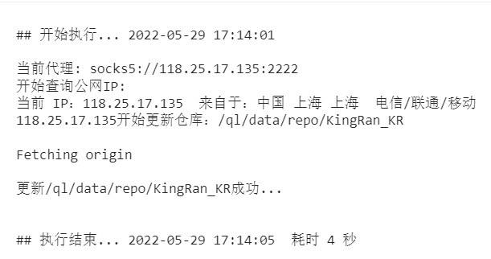

# 青龙使用代理池来避免黑IP问题
## 不确定是否有效，根据网上青龙代理教程写的，并不确定是否真的生效，代理池如果都不能使用，会自动删除代理，等下次代理池更新后再获取可用代理
使用的库
```
pip3 install requests
pip3 install datetime
pip3 install time
pip3 install random
pip3 install json
```
### 在脚本的第9行改成自己的配置文件地址，一般青龙目录都是这个
path = '/root/ql/config/config.sh'
### 在脚本的第10改成代理添加的行数，
line = int(134)
我的之前134行之前使用其他http代理，使用更改的是134行，请查看config.sh配置文件查看自己需要添加哪一行
<br>

<br>
在配置文件添加后如果使用代理可以看到

```
export ALL_PROXY=socks5://106.55.227.232:1024
#获取IP地址
export ALL_PROXY=$ALL_PROXY
echo '当前代理:' $ALL_PROXY
echo '开始查询公网IP:'
curl --silent --location --request GET 'https://myip.ipip.net/'
```
可以看到日志输出如下
<br>



代理脚本会根据抓取的代理池更新而延迟一秒钟更新，代理池大部分代理可用请放心使用
<br>
线程守护运行脚本
```
nohup python3 ip_broker.py &
```

